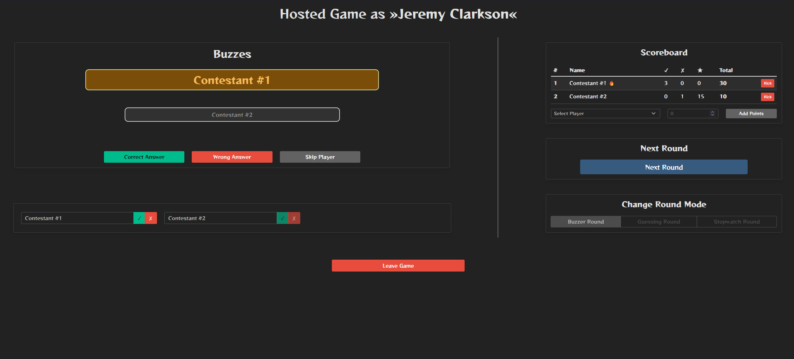
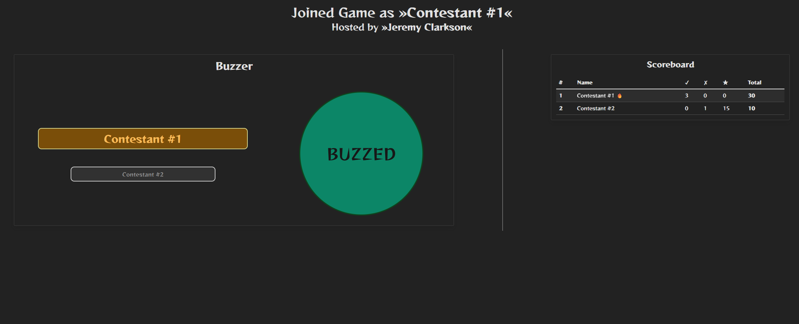

# Buzzer.py

A real-time quiz buzzer built with Flask and Socket.IO. One player hosts a
game, while others join it to buzz, submit guesses, and track scores.

## Screenshots

#### Host


#### Player


## Run locally

Install the Python dependencies and start the development server:

```sh
poetry install
poetry run python buzzapp/app.py
```

Open <http://127.0.0.1:5000> in a browser. The local server uses a development-only session key; do not use it for a public deployment.

## Deploy to Render

Deploy this as a **Web Service**:
1. In the Render Dashboard, select **New > Web Service** and connect the repository.
2. Use these service settings:
   | Setting | Value |
   | --- | --- |
   | Runtime | `Python 3` |
   | Root Directory | Leave empty |
   | Build Command | `poetry install --only main` |
   | Start Command | `poetry run python buzzapp/app.py` |
   | Health Check Path | `/health` |

3. Add these environment variables in Render:

   | Name | Value |
   | --- | --- |
   | `PYTHON_VERSION` | `3.14.6` |
   | `SECRET_KEY` | A newly generated, high-entropy secret |

4. Create the service. Render assigns an `onrender.com` URL once the first deploy completes, and pushes to the configured branch trigger future deploys.

The app reads Render's `PORT` environment variable and binds to `0.0.0.0` automatically. Render supports WebSocket connections on the same public port.
